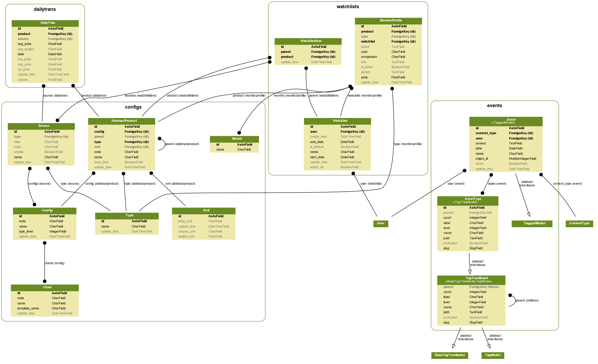

## Template used

[Smart Admin](https://wrapbootstrap.com/theme/smartadmin-responsive-webapp-WB0573SK0)


## Development with Docker

Setup `src/dashboard/settings/local.py`, with following configurations:
```
from .base import *
DATABASES = {
    'default': {
        'ENGINE': 'django.db.backends.postgresql_psycopg2',
        'NAME': 'postgres',
        'USER': 'postgres',
        'PASSWORD': 'postgres',
        'HOST': 'postgres',
        'PORT': '5432',
    },
}
```

Create your own `.env` file at root, e.g. using `.env.example`:
```
$ cp .env.example .env
```

Use `--build` to rebuild image, `-d` to run containers in the background :
```
$ docker-compose up
```

Use `-v` to clean volume while stop containers:
```
$ docker-compose down -v
```

## Initialize Fixtures

[README](https://github.com/COAStatistics/aprp/blob/master/src/fixtures/README.md)

## Demo


## Database Hierarchy



## Database Compatibility

* Postgres
